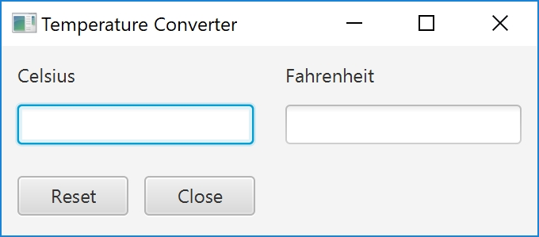
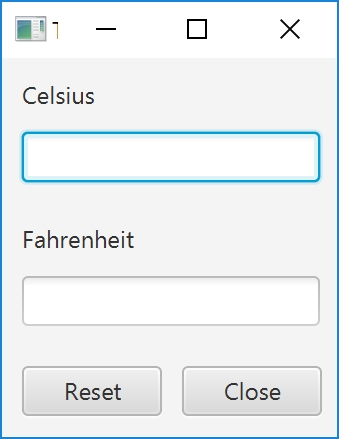

Programmation Java @ Et3
<br>
Polytech Paris-Saclay | 2020-21

---

# TP1

Le but de ce TP est de créer un programme de conversion de températures.
Ce programme devra contenir :

-   deux titres (cf. [_Label_](https://docs.oracle.com/javase/8/javafx/api/javafx/scene/control/Label.html)), "Celsius" et "Fahrenheit";
-   deux champs de texte (cf. [_TextField_](https://docs.oracle.com/javase/8/javafx/api/javafx/scene/control/TextField.html)), pour entrer et afficher des températures;
-   deux boutons (cf. [_Button_](https://docs.oracle.com/javase/8/javafx/api/javafx/scene/control/Button.html)), "Close" (pour fermer l'application) et "Reset" (pour vider les champs de texte).

<br><div align="center"></img></div><br>

1. Importez ce projet dans votre IDE.

> Suivez les indications sur ce lien : https://codimd.math.cnrs.fr/MHC4V4TsRAmby-wZVfOPhQ#

2. Dans le fichier _TemperatureConverter.java_, complétez la fonction `initGUI()` pour qu'elle agence correctement les différents éléments graphiques (la disposition finale doit être proche de celle de la photo). Utilisez la classe [_FlowPane_](https://docs.oracle.com/javase/8/javafx/api/javafx/scene/layout/FlowPane.html) pour le contenant principal puis d'autres [_Panes_](https://docs.oracle.com/javase/8/javafx/api/javafx/scene/layout/Pane.html) de votre choix pour les autres éléments.

3. Assurez-vous que les éléments graphiques sont correctement alignés et que leurs positions sont cohérentent avec la photo suivante lorsque vous changez la taille de la fenêtre.

<br><div align="center"></img></div><br>

4. Le `textFieldCListener` réalise les actions suivantes si l'utilisateur appuie sur la touche _ENTRÉE_, alors que le focus est sur textFieldC :

-   lire la valeur indiquée dans le champs de texte correspondant à la valeur en _Celsius_;
-   transformer cette valeur en float (attention à la gestion des exceptions !);
-   convertir cette valeur en _Fahrenheit_;
-   écrire cette nouvelle valeur dans le champs de texte correspondant à la valeur en _Fahrenheit_.

    Associez le `textFieldCListener` au champs de texte correspondant à la valeur en _Celsius_.

> Ici, le listener en question surveille les touches du clavier. Il s'agit donc d'un [_EventHandler_](https://docs.oracle.com/javase/8/javafx/api/javafx/event/EventHandler.html) qui surveille les [_KeyEvents_](https://docs.oracle.com/javase/8/javafx/api/javafx/scene/input/KeyEvent.html). On peut créer ce listener en utilisant :
>
> ```Java
> textFieldFListener = new EventHandler<KeyEvent>()
> {
>    @Override
>    public void handle(KeyEvent e)
>    {
>       //Ce que fait le listener en cas de KeyEvent
>    }
> ```
>
> Pour associer un Listener à un champs de texte, vous pouvez utiliser la méthode [_setOnKeyPressed_](https://docs.oracle.com/javase/8/javafx/api/javafx/scene/Node.html#setOnKeyPressed-javafx.event.EventHandler-).

5. Implémentez le `textFieldFListener` pour qu'il réalise les actions suivantes si l'utilisateur appuie sur la touche _ENTRÉE_, alors que le focus est sur textFieldF :

-   lire la valeur indiquée dans le champs de texte correspondant à la valeur en _Fahrenheit_;
-   transformer cette valeur en float (attention à la gestion des exceptions !);
-   convertir cette valeur en _Celsius_;
-   écrire cette nouvelle valeur dans le champs de texte correspondant à la valeur en _Celsius_.

    Associez le `textFieldFListener` au champs de texte correspondant à la valeur en _Fahrenheit_.

6. Le `buttonCloseListener` quitte l'application . Associez-le au bouton _Close_.

> Ici, le listener en question surveille l'action liée à un bouton. Il s'agit donc d'un [_EventHandler_](https://docs.oracle.com/javase/8/javafx/api/javafx/event/EventHandler.html) qui surveille les [_ActionEvents_](https://docs.oracle.com/javase/8/javafx/api/javafx/event/ActionEvent.html).

7. Implémentez le `buttonResetListener` pour qu'il vide les deux champs de texte. Associez-le au bouton _Reset_.

8. (Bonus) Associez un [_TextFormatter_](https://docs.oracle.com/javase/8/javafx/api/javafx/scene/control/TextFormatter.html) aux deux champs de texte pour qu'ils n'acceptent que des entrées valides (e.g. 23, 23.345, -21, 3E -02).
